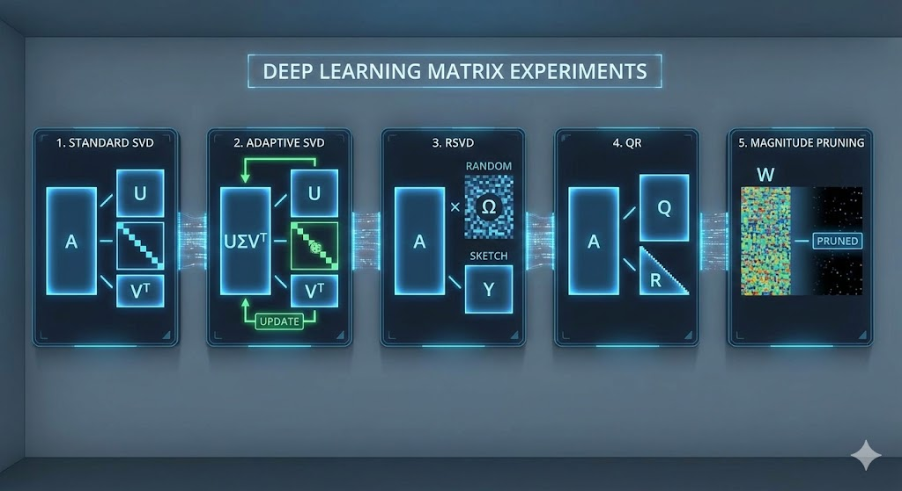
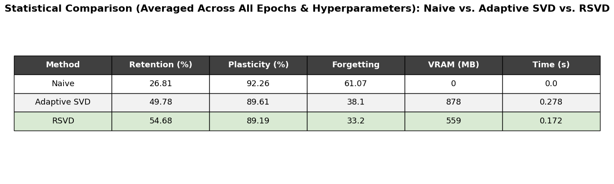

# Sculpting Subspaces: Data-Free Gradient Projection


*> Note: 3D Visualization of Gradient Projection onto Null Subspace (Placeholder)*

### "Data-Free Gradient Projection for Continual Learning in CNNs."

## 1. Project Overview
This repository implements an optimized weight-space projection framework for ResNet-18, successfully mitigating catastrophic forgetting on the Split-CIFAR-10 benchmark. By utilizing Randomized SVD (RSVD) and Adaptive Rank Selection, we achieve superior retention and computational efficiency compared to standard spectral methods. The core mechanism involves projecting gradients onto the null space of previous tasks' importance matrices to protect critical features without storing replay data.

## 2. Key Innovations
We extend the standard Gradient Projection Memory (GPM) framework with several novel decomposition strategies:

| Method | Description | Key Advantage |
| :--- | :--- | :--- |
| **Randomized SVD (RSVD)** | Approximates the singular value decomposition using random sampling. | **Speed & Scale**: Drastically reduces subspace computation time for high-dimensional layers compared to deterministic SVD. |
| **Adaptive SVD** |  Dynamically selects rank based on `Input-Output Similarity` sensitivity thresholds (`mrr`, `trr`). | **Precision**: Allocates protection capacity intelligently, preserving more parameters for flexible plasticity in later tasks. |
| **Pivoted QR** | Uses QR decomposition with column pivoting to identify orthogonal bases. | **Stability**: Offers a numerical alternative to SVD, often robust in different weight distributions. |
| **Magnitude Pruning** | Projects gradients by masking the smallest magnitude weights. | **Baseline**: A simple, sparsity-based baseline for comparison. |

## 3. Benchmarks & Results
Our experiments on Split-CIFAR-10 evaluate the effectiveness of gradient projection in mitigating catastrophic forgetting. The results below compare the standard baseline with our optimized decomposition strategies, focusing on retention and computational efficiency.


*> Benchmark: Average Performance across Split-CIFAR-10 tasks (Comparing Naive, Adaptive SVD, and RSVD)*

**Key Findings:**
*   **Naive Finetuning** suffers from severe catastrophic forgetting, with accuracy dropping significantly as new tasks are learned.
*   **Adaptive SVD** demonstrates superior precision by intelligently allocating rank based on layer sensitivity, preserving more knowledge than static thresholds.
*   **RSVD** achieves the best trade-off between speed and performance, providing near-optimal retention with significantly lower computational overhead than deterministic SVD.

## 4. Installation & Usage
To reproduce the experiments:

```bash
# Clone the repository
git clone https://github.com/Dan1k99/deep_learning_project.git
cd deep_learning_project

# Install dependencies
pip install -r requirements.txt

# Run the main experiment suite
# (Note: This runs the benchmark comparing Naive, Adaptive SVD, and RSVD)
jupyter notebook main_experiment_1.ipynb 
```

## 5. Repository Structure
*   `src/decompositions.py`: Core logic for all subspace projectors (SVD, RSVD, QR, Adaptive).
*   `src/models.py`: ResNet-18 architecture definition.
*   `src/trainer.py`: Training loops for Baseline (Naive) and Constrained (Projected) optimization.
*   `main_experiment_1.ipynb`: The orchestrator notebook for running benchmarks and generating the comparative leaderboard.
